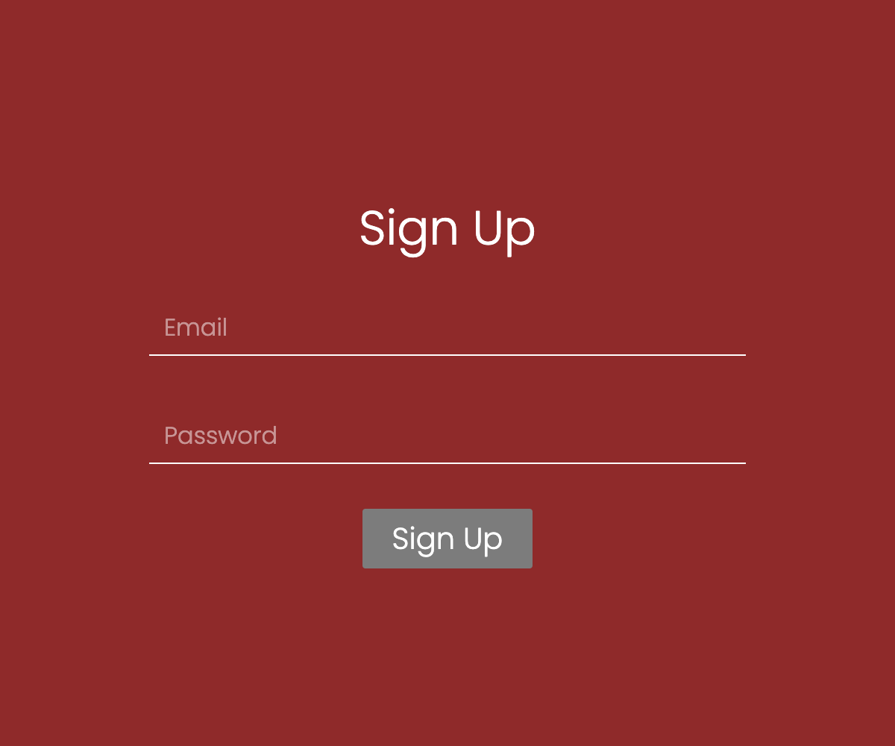

# Daily UI Design Challenge - #001 Sign Up

This is a design challenge #001 Sign Up to the [Daily UI](https://www.dailyui.co/).

## Table of contents

- [Daily UI Design Challenge - #001 Sign Up](#daily-ui-design-challenge---001-sign-up)
  - [Table of contents](#table-of-contents)
  - [Overview](#overview)
    - [Screenshot](#screenshot)
  - [My process](#my-process)
    - [Built with](#built-with)
    - [What I learned](#what-i-learned)
    - [Continued development](#continued-development)
    - [Useful resources](#useful-resources)
  - [Acknowledgments](#acknowledgments)

## Overview

### Screenshot

## My process

### Built with

- Web Component

### What I learned

- How to build a web component.

### Continued development

- Add tests?
- I wanted to control the styling of autocomplete on Chrome, but there seems to be no way for now. [This](https://css-tricks.com/snippets/css/change-autocomplete-styles-webkit-browsers/) told me how to control the color, but [this](https://stackoverflow.com/questions/56271193/styling-an-autofill-suggestion) told me there's no way to control fonts.

### Useful resources

- [How To Create A Native Web Component Without A Framework](https://www.thinktecture.com/en/web-components/native-web-components-without-framework/) - This really helped me for building my first web component.
- [Fire events in a web-component](https://stackoverflow.com/questions/65890122/fire-events-in-a-web-component) - I needed to learn how to emit events to where using the component.
- [HTML - Keep placeholder when user types](https://stackoverflow.com/questions/26324252/html-keep-placeholder-when-user-types) - This gives me a hint to create moving placeholder.

## Acknowledgments
